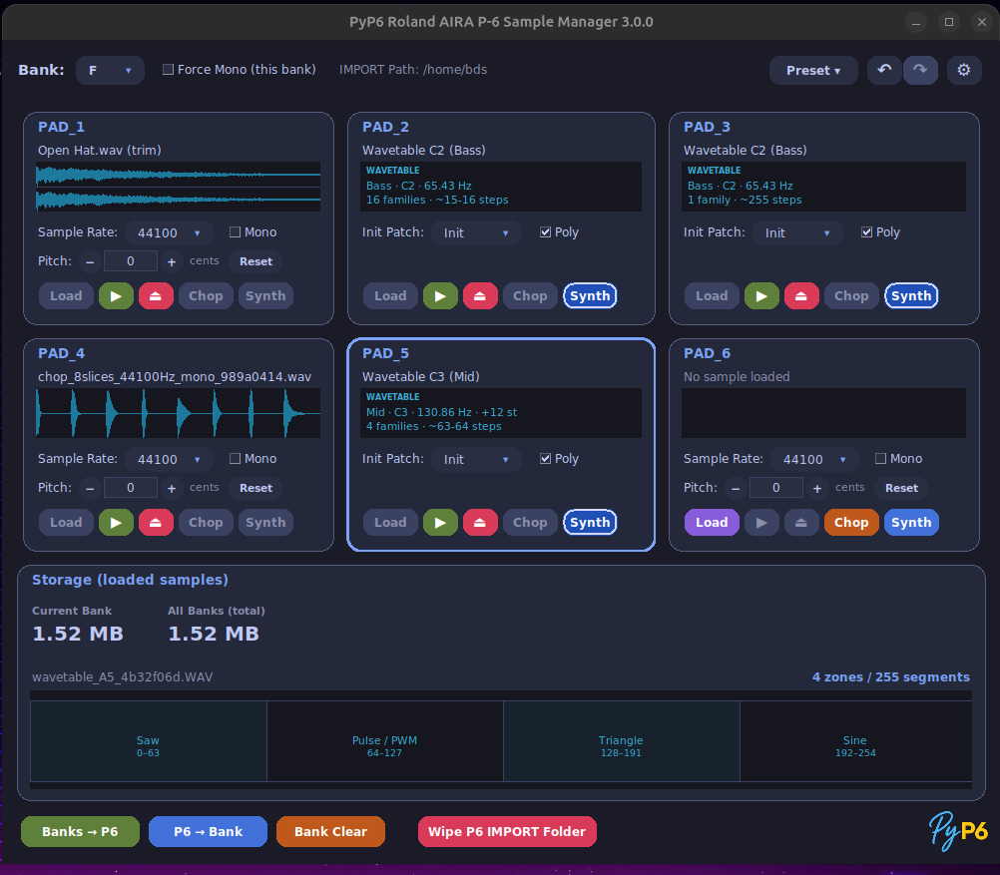
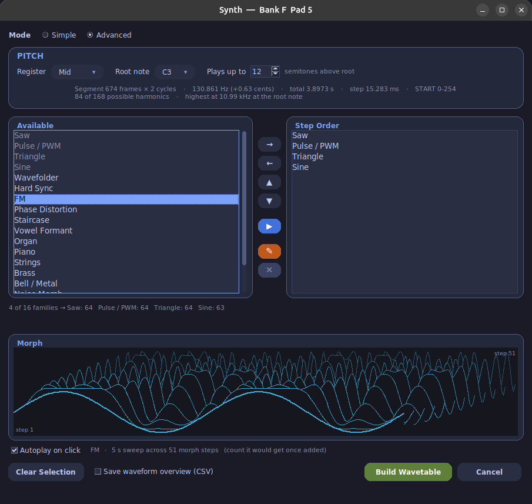
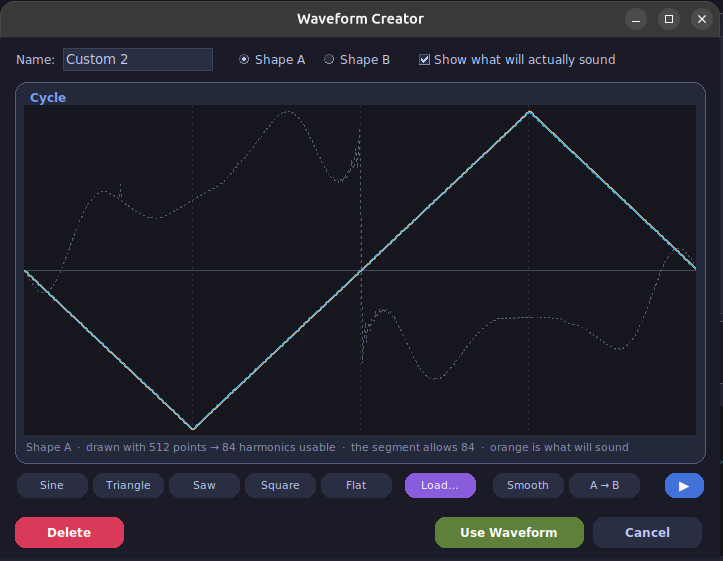

# PyP6 - Roland P-6 Sample Manager


**Version 3.0.0** — © 2026 Brian Siemund

PyP6 is a free desktop application (Python + Tkinter) for managing WAV/MP3 samples
across the 8 banks (A–H) and 6 pads per bank of the Roland AIRA P-6.

> **Windows users:** a prebuilt **Windows x64 executable** is available — no Python,
> pip, or ffmpeg setup required. See [Installation](docs/INSTALLATION.md).

---

## Features

- **Browse & audition** samples before loading, with waveform preview and trim markers
- **Non-destructive editing** — trim, normalize, fade; original files are never modified
- **MP3 → WAV conversion** via ffmpeg/pydub
- **Per-pad settings** — sample rate (11–44 kHz), pitch (±1200 cents), mono/stereo
- **Bidirectional device transfer** — Banks → P6 and P6 → Bank
- **Presets** — self-contained folders that travel with their samples
- **Chop** — combine several one-shots into a single P-6-ready multi-sample file
- **Wavetable synthesizer** *(new in 3.0.0)* — turn any pad into 255 morphing waveforms you sweep through with the START knob
- **Waveform Creator** *(new in 3.0.0)* — draw or load your own single-cycle shapes; they morph across the table and are saved to a personal library
- **Undo / Redo** — 5 steps across all banks (`Ctrl+Z` / `Ctrl+Shift+Z`)
- **Drag-and-drop** — from the file manager onto a pad (requires `tkinterdnd2`)
- **Six themes** — `dark`, `tokyo`, `dracula`, `modern`, `latte`, `bright`

---

## Quick Start

```bash
# With uv (recommended)
pip install uv
uv sync
uv run pyp6

# With pip
pip install sounddevice soundfile numpy pydub tkinterdnd2 audioop-lts
python -m pyp6
```

On first launch, point **Settings → IMPORT Folder** at the `IMPORT` directory on the P-6 drive.

---

## What's New in 3.0.0

### Wavetable Synthesizer


Click **Synth** on any pad to build a 255-step wavetable. Choose from 16 waveform
families (Saw, PWM, FM, Vowel Formant, Strings, …), set the root note and register,
preview before building, and the pad receives its WAV + `.PRM` file. On the P-6:
set **SIZE to 1** and turn **START**.

### Waveform Creator


Draw two shapes (A and B) and the family morphs between them. Or load a single-cycle WAV
— only the shape is used. Your waveforms are saved to `~/.pyp6/waveforms.json` and travel
inside presets.

### Other 3.0.0 changes

- Click the large waveform to play from that position (wavetable pads show their layout)
- Preset integrity check on save/load
- Unified rounded-panel style across all dialogs
- Improved zoom and trim precision on long files

---

## Documentation

| Document | Contents |
|---|---|
| [Installation](docs/INSTALLATION.md) | Windows exe, run from source (Windows + Linux), system requirements |
| [Usage](docs/USAGE.md) | Loading samples, editing, Chop, Synth, presets, device transfer, settings |
| [Development](docs/DEVELOPMENT.md) | Project layout, running tests, Makefile, building the Windows exe |
| [Troubleshooting](docs/TROUBLESHOOTING.md) | Common errors and fixes |

---

## Credits

- Chop/multi-sample concept inspired by
  [p6-wave-slice](https://github.com/warreneblackwell/p6-wave-slice) by **Warren Blackwell**

---

*Roland, AIRA and P-6 are trademarks of Roland Corporation.
This is an independent project and is not affiliated with, endorsed by or supported by Roland.*
