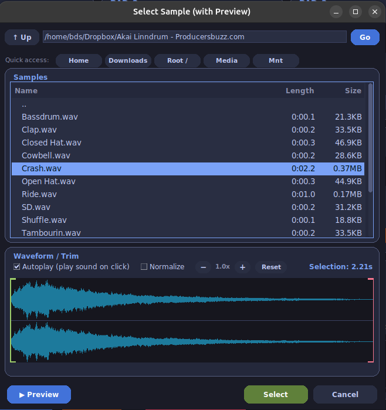
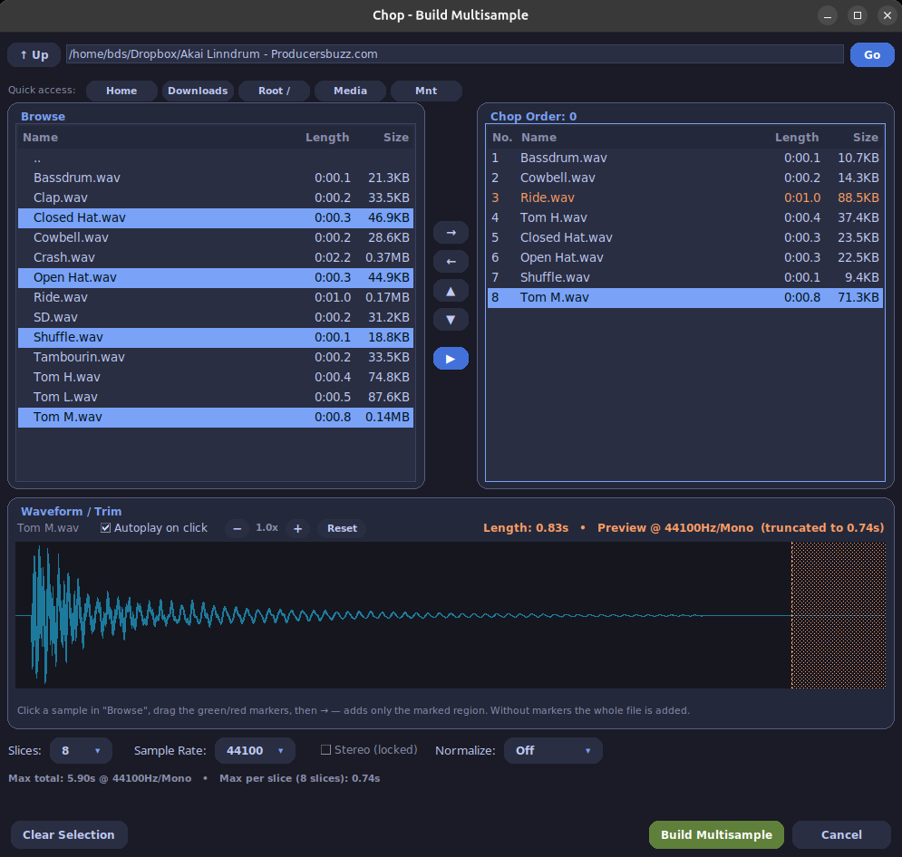

# Usage Guide

← [Back to README](../README.md)

---

## 1. First Launch — Setting the IMPORT Folder

On first launch PyP6 attempts to auto-detect the P-6 IMPORT folder. Use
**Settings → IMPORT Folder → Change...** to point it to the correct location if needed.
The path is remembered across restarts. The folder you are looking for is inside the P-6
drive: `<P-6 drive>/IMPORT/`.

---

## 2. Loading a Sample

Click **Load** on any pad to open a file browser with:

- Folder navigation and sortable columns (Name / Length / Size)
- Waveform preview and audition playback (with optional **Autoplay**)
- Green and red bracket markers — drag them to load only a trimmed region
- **Normalize** checkbox

Confirm with **Select** or by double-clicking a file. Trimmed/normalized results are
written to the temp folder; the original file is never modified.

---

## 3. Per-Pad Settings

Each pad offers:

- **Sample Rate** — 44100, 22050, 14700, or 11025 Hz
- **Pitch** — ±1200 cents in 100-cent steps via +/− buttons, direct entry, or **Reset**
- **Mono** — forces this pad's sample to mono. The bank-wide **Force Mono (this bank)**
  switch in the top bar overrides and greys it out while active.

If the resulting sample would exceed the P-6's maximum recording time for the chosen
rate/channel combination, a warning appears and the excess portion is shaded orange
in the pad's mini waveform.

---

## 4. Editing a Loaded Sample

Click a pad's **mini waveform** to open the editor:

- Drag green/red markers to shorten; mouse wheel to zoom
- **Normalize** and **Fade In / Fade Out** (0–1.0 s, logarithmic), previewed live
- The header shows the file's own rate and the pad's export settings; the orange area
  shows what the P-6 would cut off at those settings
- **Apply to Pad** writes the result to a new temp file and puts it back on the pad.
  `Ctrl+Z` undoes it; the original file is untouched.

> Chop multisamples: trim and fade are disabled (slice boundaries would shift).
> Normalize remains available.

---

## 5. Rearranging Pads and Dropping Files

Drag a pad's **sample name** (or the pad frame itself) onto another pad to swap the two,
including rate, pitch and mono settings. The target pad is outlined in orange while you
drag. Swaps are undoable.

Drop audio files from the file manager directly onto a pad — the pad under the cursor is
outlined in green. Dropping several files fills the following pads in order. Requires the
optional `tkinterdnd2` package.

> **Platform note:** drag & drop is reliable on Windows. On Linux under Wayland an
> occasional drop is missed — just drag again or use the pad's Load button. **Settings →
> About** shows whether drag & drop actually initialised.

---

## 6. Playback and Removal

- **▶** plays the pad's sample exactly as it will sound after export and shows a
  live playhead in the large waveform at the bottom. The playing pad is outlined in blue
  and the button turns into a Stop square.
- **⏏** clears the pad, optionally deleting the matching file from the device.

---

## 7. Transferring to and from the Device

- **Banks → P6** — tick the banks to export; a live total-size readout shows how much
  you're about to transfer. Each pad's sample is converted and written to
  `IMPORT/BANK_x/PAD_n/`. If a bank exceeds your configured storage threshold you'll be
  asked to confirm. The P-6 must be in **storage mode** (hold Record, switch power on)
  before uploading. After uploading, press a key on the device and wait for "done".
- **P6 → Bank** — walks you through the device's own export procedure, then reads the
  resulting EXPORT folder into the active bank. Rate/pitch/mono come in at defaults.

---

## 8. Clearing

- **Clear Bank** — empties all 6 pads of the current bank in the app only; no files on
  disk or device are touched. Undoable.
- **Wipe P6 IMPORT Folder** — permanently deletes every sample file in the device's
  IMPORT folder across all banks, after a confirmation. Cannot be undone.

---

## 9. Presets

Use the **Preset** button in the top bar:

- **Save Preset...** — pick a folder and a name, tick which banks to include. Samples are
  copied into the preset folder so it stays usable after the temp folder is cleared.
  Saving over an existing preset replaces only the checked banks.
- **Load Preset...** — click a preset folder to see its banks, then tick which to load.
  With exactly one bank selected you can load it into the current slot instead of its
  original one.
- **Recent** — the last five presets, one click away.

---

## 10. Chop — Building a Multi-Sample

Click **Chop** on any pad to combine several one-shots into a single WAV ready to be
split with the P-6's built-in **Chop** function in Sample Edit (Voice) mode.

*Concept inspired by [p6-wave-slice](https://github.com/warreneblackwell/p6-wave-slice)
by Warren Blackwell.*

**Workflow:**

1. Browse to a folder and **Add to Selection** the files you want.
2. Preview/audition; drag trim markers on the waveform to use only a region.
3. Reorder with ↑/↓ (`Alt+Up` / `Alt+Down`) — that order is the slice order on the
   device. `Del` removes an entry.
4. Choose **Slices** (1–64), **Sample Rate**, and Stereo/Mono.
5. Choose a **Normalize** mode:
   - `Off` — levels stay as-is
   - `Per sample` — every slice lifted individually
   - `Whole file` — only the finished multisample is lifted; balance between slices
     is preserved
6. Click **Build Multisample**. The finished file loads directly onto the pad.

Anything that would be cut off is shaded orange in the waveform while you work.

**Slice duration reference:**

| Sample Rate | Channels | Max Duration | 32 Slices | 64 Slices |
|-------------|----------|--------------|-----------|-----------|
| 44.1 kHz    | Mono     | 5.9 s        | 184 ms    | 92 ms     |
| 22.05 kHz   | Mono     | 11.8 s       | 369 ms    | 184 ms    |
| 14.7 kHz    | Mono     | 17.8 s       | 556 ms    | 278 ms    |
| 11.025 kHz  | Mono     | 23.7 s       | 741 ms    | 370 ms    |
| 44.1 kHz    | Stereo   | 2.95 s       | 92 ms     | 46 ms     |
| 22.05 kHz   | Stereo   | 5.9 s        | 184 ms    | 92 ms     |

After building, load the file onto the P-6, enter Sample Edit (Voice) mode, and use the
device's **Chop** function to split it into the same number of slices.

---

## 11. Wavetable Synthesizer

Click **Synth** on an empty pad. The pad becomes a wavetable: one WAV holding 255
single-cycle waveforms, plus a `.PRM` file with loop points and an init patch.

**In the dialog:**

1. Choose a **register** (Bass ≈ C2, Mid, Lead ≈ C3) and a **root note** (±6 semitones).
   This is the pitch the pad plays at.
2. **Plays up to** — how far above the root you'll transpose. Leave at 0 if you'll only
   play near the root note.
3. **Simple mode** — bakes all 16 families, ~16 steps each.
   **Advanced mode** — choose which families and their order, up to 16.
4. Click a family to see its morph in the isometric display; tick **Autoplay on click**
   to hear each one automatically.
5. Click **Build Wavetable**.

**On the P-6:** transfer the bank, set **SIZE to 1**, turn **START**. Positions 0–254
each select a waveform; position 255 is past the end and won't sound usefully.

> Load and Chop are greyed out on a wavetable pad. **Synth** stays available to change
> the note or families and rebuild. Eject first if you want a normal sample there.

---

## 12. Waveform Creator

The ✎ button between the two lists opens the Waveform Creator.

- **Draw** two shapes (A and B) with the mouse — the family morphs between them. Start
  from a sine, triangle, saw or square preset and draw over it; **Smooth** removes
  shakiness.
- **Load...** reads a single-cycle WAV instead. Only the shape is used; pitch comes from
  your chosen root note. Files are previewed as a held note so you can hear them.
- The **orange line** shows what the P-6 will actually hold over your blue drawing. They
  differ where your line has sharper corners than the P-6 can reproduce.

Waveforms are saved to `~/.pyp6/waveforms.json` and appear in every wavetable session
afterwards. They travel inside presets so a preset with your own waveforms works on
someone else's machine.

> A normal sample is not a single-cycle file. Loading a drum loop squeezes the whole
> recording into one waveform shape — the app warns you first.

---

## 13. Settings

**Settings** (gear icon) covers:

- **IMPORT Folder** — location the "Banks → P6" upload writes to
- **Appearance** — theme (`dark`, `tokyo`, `dracula`, `modern`, `latte`, `bright`;
  restart required) and tooltip toggle (applies immediately)
- **Audio Components** — state of pydub/ffmpeg, manual path overrides for
  `ffmpeg.exe`/`ffprobe.exe`
- **Defaults** — Autoplay starting state, default Chop slice count, storage warning
  threshold (MB)
- **Temporary Files** — current size, **Clear Now**
- **About** — version, author, live state of every optional component, **Copy Info**
  button for bug reports
